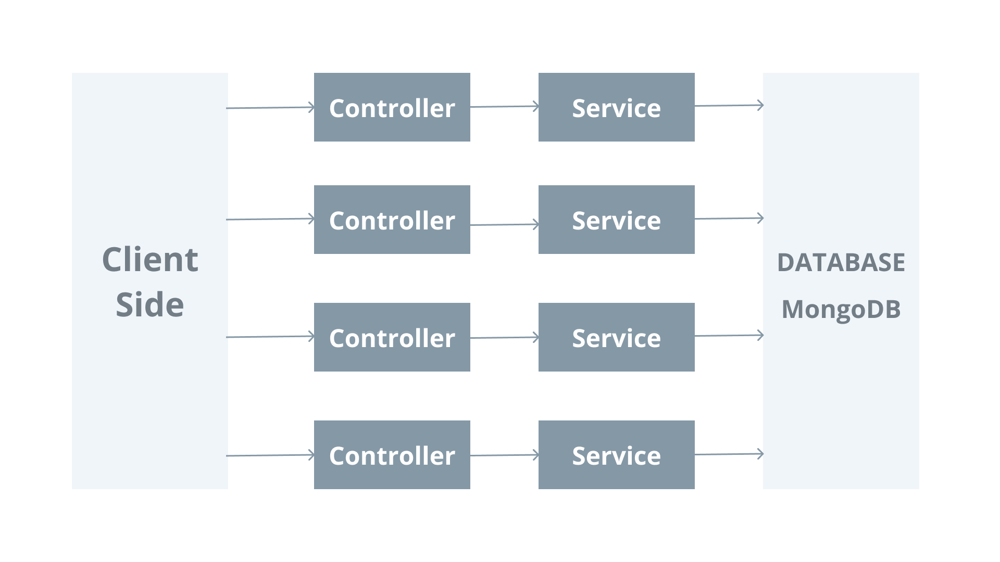

## Getting Started

[NestJS](https://nestjs.com), A progressive Node.js framework for building efficient, reliable and scalable server-side applications. NestJS has an Angular-like project structure that splits code into modules.

Install official NestJS cli using npm and create a new nest project.

``` bash
$ npm install -g @nestjs/cli
$ nest new project-name
```



## Modules

Modules are class decorated with `@Module()` that holds the metadata about controllers, providers and other configurations. Modules can be generated using Nest cli.

```bash
$ nest g module products
CREATE src/products/products.module.ts (85 bytes)
UPDATE src/app.module.ts (324 bytes)
```
```ts
import { Module } from '@nestjs/common';

@Module({})
export class ProductsModule {}
```

## Controllers

Controllers are responsible for handling incoming requests and returning responses to the client. They can be generated using Nest cli or you can define them by yourself with decorators.

```bash
$ nest g controller products
CREATE src/products/products.controller.spec.ts (506 bytes)
CREATE src/products/products.controller.ts (105 bytes)
UPDATE src/products/products.module.ts (182 bytes)
```
```ts
import { Controller } from '@nestjs/common';

@Controller('products')
export class ProductsController {}
```

## Services

Services can be used as data access layer. These are typescript classes with `@Injectable()` decorator and can be injected in other services or controllers. 

```bash
$ nest g service products
CREATE src/products/products.service.spec.ts (474 bytes)
CREATE src/products/products.service.ts (92 bytes)
UPDATE src/products/products.module.ts (268 bytes)
```
```ts
import { Injectable } from '@nestjs/common';

@Injectable()
export class ProductsService {}
```

## Adding MongoDB


## Setting up sample data

Create an interface `Product` in src/products to strongly type the domain model.


## Request methods

Implement request methods like GET, POST, PUT, PATCH and DELETE using decorators imported from `@nestjs/common`
